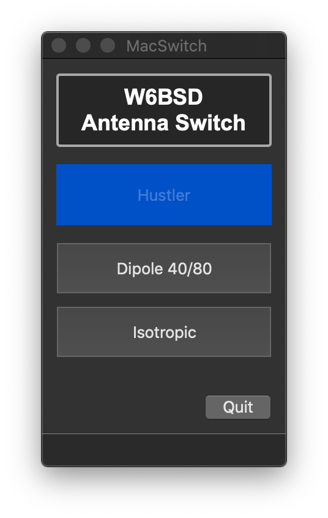

# MacSwitch

`Development in progress`

### Antenna Switch companion program

MacSwitch works with the ham radio HF Remote Antenna Switch. You can
find more information on the hardware on my [blog post][1].

## Installation

```
$ pip install MacSwitch --user
```

# Usage

Click on the button to switch between antennas.



[1]: https://0x9900.com/remote-controlled-antenna-switch/
